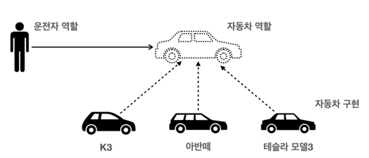
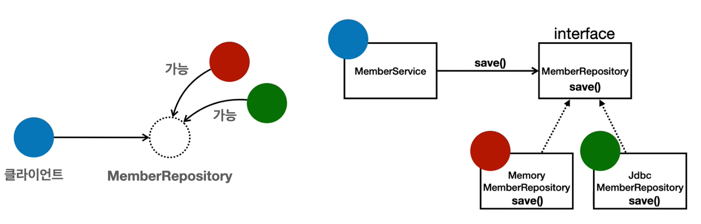

## 객체 지향 프로그래밍이란?
컴퓨터 프로그램을 명령어의 목록으로 보는 시각에서 벗어나 여러개의 독립된 단위, 즉 `객체` 들의 모임으로 파악하고자 하는 것이다.  

각각의 `객체` 는 `메시지` 를 주고받고, 데이터를 처리할 수 있다. <b>(협력)</b>

객체 지향 프로그래밍은 프로그램을 <b>유연</b>하고 <b>변경</b>이 용이하게 만들기 때문에 대규모 소프트웨어 개발에 많이 사용된다.  
이는 객체 지향의 핵심인 `다형성` 이라고도 한다.

## 다형성의 실세계 비유
<b>역할</b>과 <b>구현</b>으로 세상을 구분해보자.  

예를 들어 운전자-자동차의 경우를 보자.  

운전자는 자동차의 종류가 바뀌어도 영향을 주지 않는다.  
-> 구현 객체가 바뀐다고 해도 클라이언트에게 영향을 주지 않는다.  

운전자는 자동차 역할에만 의존한다.  
-> 인터페이스에 의존한다.

## 자바 언어의 다형성
### 오버라이딩

## 다형성의 본질
- 인터페이스를 구현한 객체 인스턴스를 <b>실행 시점</b>에 <b>유연</b>하게 변경할 수 있다.
- 다형성의 본질을 이해하려면 <b>협력</b>이라는 객체사이의 관계에서 시작해야함
- <b>클라이언트를 변경하지 않고, 서버의 구현 기능을 유연하게 변경할 수 있다.</b>

## Spring 과 객체 지향
- 다형성이 가장 중요하다.
- Spring 은 다형성을 극대화해서 이용할 수 있게 도와준다.
- Spring 에서 이야기하는 제어의 역전(IoC), 의존관계 주입(DI) 은 다형성을 활용해서 역할과 구현을 편리하게 다룰 수 있도록 지원한다.